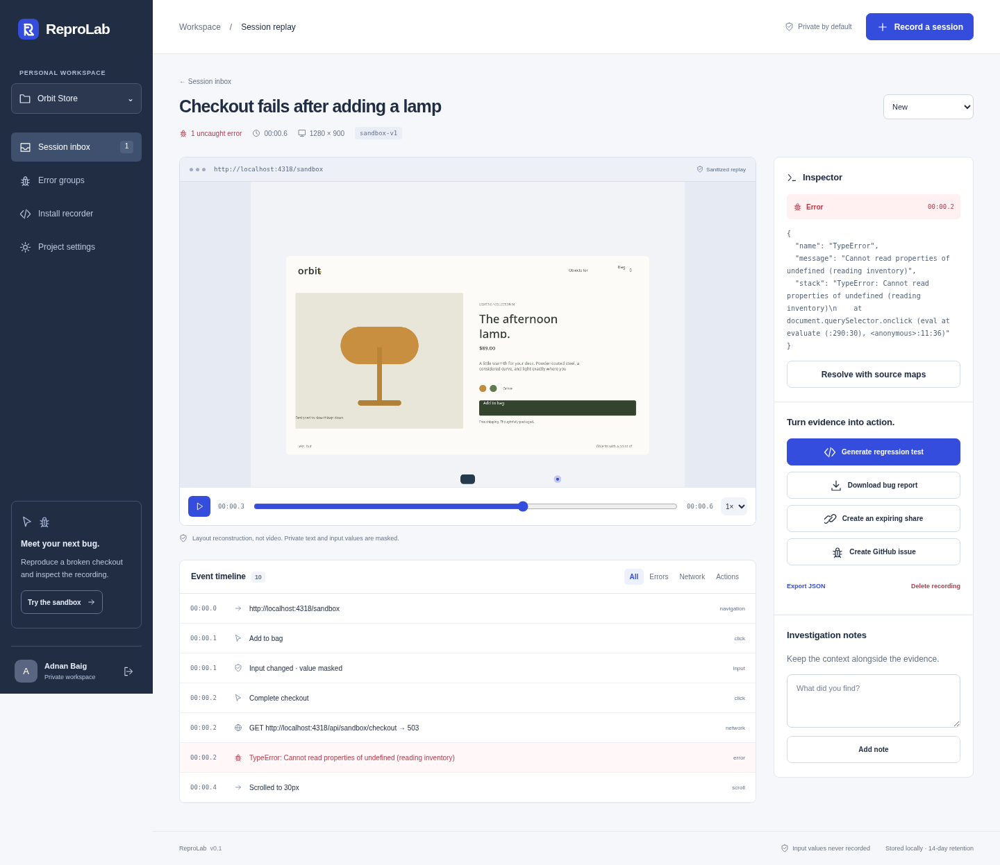

# ReproLab

**Turn “it broke” into evidence you can inspect.**

ReproLab is a self-hosted browser bug workbench. Start a recording, reproduce the failure, inspect a sanitized visual timeline, and export a Playwright regression-test draft. It includes a real broken-checkout sandbox, not a dashboard filled with fake telemetry.

**Status: v0.1 working developer prototype.** The core workflow requires a MongoDB deployment but no hosted ReproLab service, subscription, or external API key. There is no public production deployment. See [verification](#verification) for exactly what was and was not tested.


*Actual interface rendered in Chromium using an isolated synthetic checkout recording. This is a test fixture, not customer traffic.*

## Run it

Install **Node.js 22.16 or newer**, **pnpm 10**, and configure a MongoDB Atlas connection in `.env.local`:

```bash
cp .env.example .env.local
# Add MONGODB_URI to .env.local. Never commit this file.
pnpm install --frozen-lockfile
pnpm dev
```

Open **http://localhost:3000**. ReproLab is a Next.js App Router application with a Node.js server runtime and MongoDB persistence. The database connection remains server-only; the client bundle never receives `MONGODB_URI`.

1. Choose **Create workspace** and create a local account. Passwords require at least 12 characters.
2. Select **Record a session** to open the included Orbit Store sandbox.
3. Select **Start recording**, add the lamp to the bag, enter a dummy email, and complete checkout.
4. Checkout deliberately fails with an HTTP 503 and an uncaught error.
5. Select **Stop & save → Open replay**.
6. Inspect the visual frames, click/network/error timeline, and failure details. Add notes and update triage status.
7. Generate a Playwright draft, export a Markdown bug report or JSON evidence, or create an expiring read-only share.

The sandbox automatically creates its own project and ingestion key in your workspace. Its sample email input is masked; use synthetic information anyway.

For a production server:

```bash
pnpm run build
pnpm start
```

Development with restart-on-change: `pnpm run dev`. Runtime data is stored in the configured MongoDB database. Keep its Atlas credentials in your local environment or deployment secret store.

## What works in this version

| Capability | Implementation |
|---|---|
| Private workspaces | Registration, scrypt password hashing, HttpOnly sessions, server-side ownership checks |
| Projects | Create, configure allowed origins, rotate ingestion keys, delete with cascade |
| Browser SDK | Explicit start/stop/upload, bounded memory, lifecycle cleanup, framework independent |
| Evidence capture | Clicks, redacted input-change events, SPA navigation, scroll, fetch/XHR metadata, console warnings/errors, uncaught errors, markers |
| Visual replay | Timestamped **layout reconstruction**, play/pause, seeking, speed controls, click indicators |
| Investigation | Search/filter inbox, error fingerprints, triage states, private notes, event inspector |
| Regression draft | Deterministic Playwright code with safe string encoding and redacted-input fixture placeholders |
| Exports | JSON evidence and Markdown issue report; no LLM account needed |
| Source maps | Private flat-v3 map upload by asset URL + release; original-position lookup |
| Sharing | Explicit expiring, revocable links; notes/source maps/owner IDs excluded |
| Persistence | MongoDB collections and indexes, upload deduplication, retention purge, application-managed cascades |
| Optional GitHub integration | Server-side issue creation behind explicit confirmation, repo allowlist and rate limit; **live integration not verified here** |
| Chrome extension | Manual active-tab recorder source included; **not installed or device-qualified here** |

## What replay actually means

ReproLab does **not** store HTML, video, raw screenshots, network bodies, cookies, or authorization headers. It records bounded visual nodes—position, dimensions, safe colors, and masked/explicitly public text—and draws those nodes on a canvas.

That makes replay useful for layout, chronology, and investigation, but **not pixel-perfect playback**. Fonts, photos, canvas/WebGL contents, pseudo-elements, cross-origin iframes, and shadow-root internals are not reconstructed. Full-document navigations terminate the current recorder; SPA history changes are captured within the current document. The SDK does not persist recordings across a reload.

Normal text is masked unless the element explicitly has `data-repro-public`. That opt-in applies to **direct text nodes only**. Inputs remain masked even with the attribute. Email/token/long-number scrubbing is defense in depth, not a guarantee that arbitrary application logs contain no personal data. Read [SECURITY.md](SECURITY.md) before instrumenting anything sensitive.

## Connect another app

Create a project in **Install recorder**, specify exact allowed website origins, and copy its ingestion-only key. Load `/sdk/reprolab.js` from your ReproLab instance, then call the SDK **inside your own explicit consent/start action**:

```html
<script src="http://localhost:3000/sdk/reprolab.js"></script>
```

```js
let recording;

// Connect this to a user-confirmed “Start recording” button.
function startBugRecording() {
  recording = ReproLab.start({
    consent: true,
    endpoint: 'http://localhost:3000/api/ingest',
    captureKey: 'YOUR_PROJECT_CAPTURE_KEY',
    title: 'Checkout fails after adding a product',
    release: 'checkout-v1'
  });
}

// Connect this to “Stop & save”. Upload is explicit, never automatic.
async function saveBugRecording() {
  const result = await recording.upload();
  console.log('Saved session:', result.id);
}
```

For useful, safe selectors:

```html
<button data-testid="checkout" data-repro-public>Complete checkout</button>
<section data-repro-private>Private account information</section>
<div data-repro-ignore>Recorder controls</div>
```

Ingestion keys are readable by the instrumented browser: they are **not dashboard credentials**. They can still be abused for submissions, so restrict origins, rotate compromised keys, and do not paste real keys into public examples. An origin allowlist is not strong authentication of arbitrary non-browser senders.

An HTTPS instrumented app needs an HTTPS collector and a CSP that permits loading the SDK and connecting to that collector. The default instance is deliberately local HTTP, not an internet service. Self-host behind TLS for remote testing; see [operations](docs/OPERATIONS.md).

## Playwright output: a draft, not magic

Generated files contain real `@playwright/test` structure, captured selectors, safe string literals, and generic assertions for uncaught errors and HTTP 5xx responses. Private input values become `REPRO_INPUT_1`, `REPRO_INPUT_2`, etc. Provide safe fixtures and review every selector.

```bash
# In your target application's existing Playwright project:
REPRO_START_URL=http://localhost:3000/checkout \
REPRO_INPUT_1=test@example.org \
pnpm exec playwright test repro-example.spec.js
```

Authenticated apps require your own `storageState`. Replace the generic settle wait with an application-specific assertion. The deliberately broken sandbox should fail a properly configured regression test until its bug is fixed. ReproLab **does not run arbitrary uploaded/generated tests on the server** or pretend to infer the correct business outcome.

## Optional source maps

Upload a flat v3 `.map` in **Install recorder**, supplying the **exact generated asset URL and release** from the captured stack. `examples/sandbox-error.min.js.map` matches the bundled sandbox error source. On a recording, select **Resolve with source maps**.

Maps can contain proprietary source. They remain owner-scoped and are not included in public shares. Indexed source maps and automatic artifact upload are not supported in v0.1.

## Optional browser extension

Load the `extension/` folder as an unpacked Manifest V3 extension in a normal development Chrome profile. Set the collector endpoint and project key, consent, start recording the active tab, reproduce the bug, then stop/upload. No all-sites host permission or background surveillance is requested.

The source is included and its recorder is byte-checked against the SDK. Extension installation, site CSP interactions, private-network restrictions, and actual popup lifecycle behavior **still need verification in a normal browser**. Do not present this as a store-ready extension.

## Optional GitHub issue creation

The core app works with this integration disabled. For a trusted self-hosted instance:

```bash
cp .env.example .env.local
# Edit .env.local locally; never commit it:
# GITHUB_TOKEN=<a fine-grained token limited to the intended repository>
# GITHUB_ALLOWED_REPOS=CodnanBaig/reprolab
pnpm start
```

Set the same `owner/repo` in Project settings. Review the exported report, then explicitly confirm **Create GitHub issue**. Tokens stay server-side. Config/permission errors do not block Markdown export. Live authenticated issue creation was not exercised during this build. A network failure after GitHub accepts a request may require checking GitHub before retrying; cross-system exactly-once delivery is not claimed.

## Verification

The dated [build report](BUILD_REPORT.md) records the pre-migration prototype evidence; it does not validate this Next.js/MongoDB migration. Run the commands below against the configured MongoDB environment before treating it as accepted:

- Unit tests cover the privacy contract, capture validation, authentication primitives, exports, and source maps.
- `pnpm run typecheck`, `pnpm run check:syntax`, and `pnpm run build` validate the Next.js application and shipped browser assets.
- `pnpm run test:browser` requires `MONGODB_URI` and creates a uniquely named test database that it drops when the suite finishes.

```bash
pnpm install --frozen-lockfile
pnpm test
pnpm run test:coverage
pnpm run check
pnpm run typecheck

# Browser verification in an unrestricted local development environment:
python3 -m venv .venv
source .venv/bin/activate
python3 -m pip install -r tests/requirements.txt
python3 -m playwright install chromium
pnpm run test:browser

# Separate isolated-browser suite, NOT a substitute for full journeys:
pnpm run test:browser:memory
```

CI is configured in `.github/workflows/ci.yml` for every push and pull request. Check GitHub Actions for the exact commit before treating the remote build as passed; the workflow file alone is not evidence.

## Architecture

**Next.js App Router + React + TypeScript + MongoDB**, with browser-native JavaScript for the framework-independent recorder. Server APIs are Next.js route handlers using the Node.js runtime.

```text
Instrumented app / manual extension
  └─ consent → recorder → client-side redaction → explicit upload
       └─ ingestion key + origin checks + bounds + server sanitization
            └─ MongoDB capture document + indexed ownership records
                 ├─ owner-scoped investigation workbench
                 ├─ sandboxed-by-construction canvas reconstruction
                 ├─ private source-map lookup
                 ├─ regression draft / Markdown / JSON
                 └─ optional expiring read-only share
```

See [architecture and trade-offs](docs/ARCHITECTURE.md), [API contract](docs/API.md), [security](SECURITY.md), [operations](docs/OPERATIONS.md), [test strategy](docs/TESTING.md), and [remaining scope](ROADMAP.md).

## Repository

The source is hosted in the private [`CodnanBaig/reprolab`](https://github.com/CodnanBaig/reprolab) repository. Clone and run it with:

```bash
git clone https://github.com/CodnanBaig/reprolab.git
cd reprolab
pnpm install --frozen-lockfile
pnpm start
```

The repository remains private and is not a hosted ReproLab service. Local `.env.local` files, test artifacts, dependencies, and compiled output are ignored.

## License

[MIT](LICENSE). Copyright 2026 Adnan Baig.
